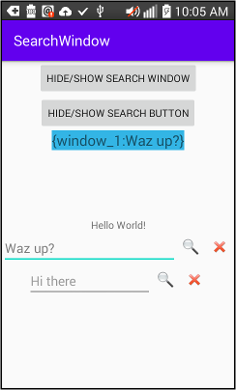

7/2/2020

# SearchWindow

I needed a window in multiple places for doing text search.
Some specific features I needed are:
*   Search and clear button.
*   The keyboard should show the "magnifing glass" icon.
*   Show/hide the view and determine its state.
*   The width of the window needed to be set-able using match_parent,
wrap contents or specific dp width.
*   Use a listener to catch changes to the text.
*   Set the text in the EditText.
*   Determine the text color for the edit window text.
*   Set the edit window hint.
*   Hide the soft keyboard when the user started search.

This is the result.  The MainActivity.kt and activity_main.xml
are example code.  Custom attributes for the EditText are in
attrs.xml.  SearchWindow.kt is the actual custom view.

